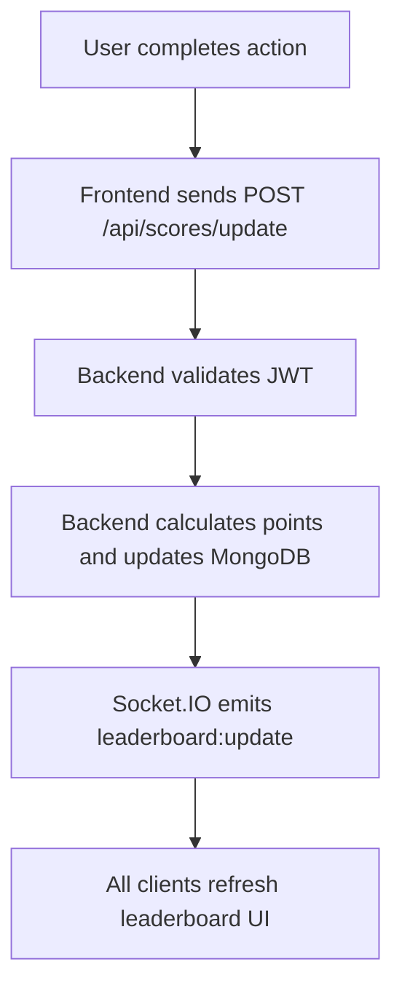

# Live Leaderboard API

## 1. Overview

This module is a small backend service for a website leaderboard. It stores user scores in MongoDB, returns the top 10 users, and pushes live updates with Socket.IO when someone earns points.

**Why it exists:** When a user completes an action in the app (like finishing a quiz), the frontend tells the backend. The backend adds points to that user's score and everyone on the site sees the updated leaderboard without refreshing.

**Tech stack:**

- Node.js + Express.js — REST API
- MongoDB + Mongoose — store users and scores
- Socket.IO — live leaderboard updates
- JWT — protect score update routes

---

## 2. Features

- Update user score when an action is completed
- Get top 10 users on the leaderboard
- Broadcast leaderboard changes to all connected clients (Socket.IO)
- JWT authentication on protected routes
- Basic anti-cheat: server calculates points, blocks duplicate actions, simple rate limiting

---

## 3. API Endpoints

All score updates require a valid JWT in the header:

```http
Authorization: Bearer <token>
```

### POST /api/scores/update

Called when the user finishes an action. The client sends the **action type only** — not a score number.

**Request:**

```json
{
  "actionType": "quiz_completed"
}
```

**Response:**

```json
{
  "success": true,
  "newScore": 150
}
```

**Notes:**

- JWT required — the backend gets `userId` from the token
- The backend decides how many points each `actionType` is worth
- The frontend must **not** send `score`, `points`, or `newScore` in the body

**Errors (examples):**

| Status | When |
|--------|------|
| 401 | Missing or invalid JWT |
| 400 | Unknown `actionType` |
| 409 | Same action already logged (duplicate) |
| 429 | Too many requests (rate limit) |

---

### GET /api/leaderboard

Returns the top 10 users by score. Can be public or protected depending on your app.

**Response:**

```json
{
  "topUsers": [
    {
      "username": "alice",
      "score": 500
    },
    {
      "username": "bob",
      "score": 420
    }
  ]
}
```

---

## 4. MongoDB Collections

### users

| Field | Purpose |
|-------|---------|
| `username` | Display name on leaderboard |
| `score` | Current total score |
| `createdAt` | When the user was created |

### actionLogs

| Field | Purpose |
|-------|---------|
| `userId` | Who did the action |
| `actionType` | e.g. `quiz_completed` |
| `createdAt` | When it happened |

**Why actionLogs?** Before updating a score, you can check if that user already got credit for the same action (for example, one `daily_login` per day, or store a unique `actionId` if the client sends one). That helps stop duplicate score bumps from double-clicks or replayed requests.

---

## 5. Authentication and Security

- **JWT authentication** — Only logged-in users can call `POST /api/scores/update`. Read `userId` from the token, not from the request body.
- **Backend validates actions** — Only allow known `actionType` values. Reject anything that does not match your list.
- **Backend calculates score** — Points come from server config (e.g. `quiz_completed` = +50). Never trust a score sent by the client.
- **Frontend cannot send score values** — Do not accept fields like `score`, `points`, or `amount` in the update body.
- **Simple rate limiting** — e.g. max 20 update requests per minute per user (use `express-rate-limit`).
- **Duplicate request checking** — Log each action in `actionLogs` and skip or reject if the same user + action was already processed (based on your rules).

---

## 6. Real-Time Updates

After a successful score update:

1. Save the new score in MongoDB.
2. Query the top 10 users.
3. Use Socket.IO to emit an event (e.g. `leaderboard:update`) with the new list to all connected clients.

Clients connect on page load, listen for `leaderboard:update`, and redraw the scoreboard. They can also call `GET /api/leaderboard` on first load or if the socket disconnects.

**Example event payload:**

```json
{
  "topUsers": [
    { "username": "alice", "score": 500 },
    { "username": "bob", "score": 420 }
  ]
}
```

---

## 7. Simple Flow Diagram



---

## 8. Future Improvements

- **Redis caching** — Cache the top 10 list so `GET /api/leaderboard` is faster under load
- **Daily leaderboard** — Reset or track scores per day with a separate collection or date field
- **Better anti-cheat checks** — Stricter rules per action, logging suspicious patterns, admin review

---

## Action Types (Example)

Define allowed types and points on the server:

| actionType | Points |
|------------|--------|
| `quiz_completed` | 50 |
| `daily_login` | 10 |
| `level_cleared` | 100 |

Add new rows here as the product grows — keep the logic in one place in the Express app.
